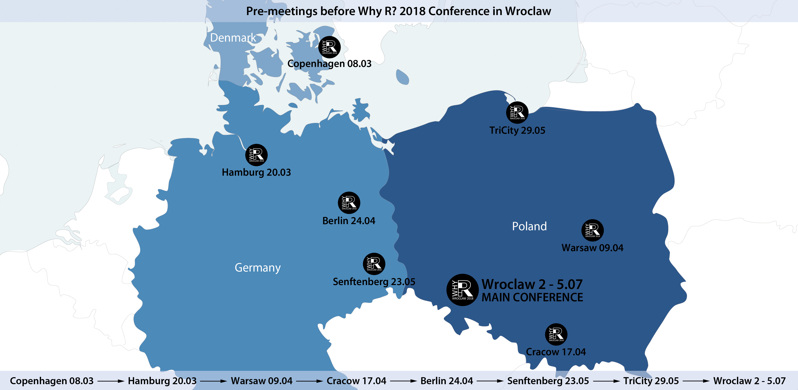
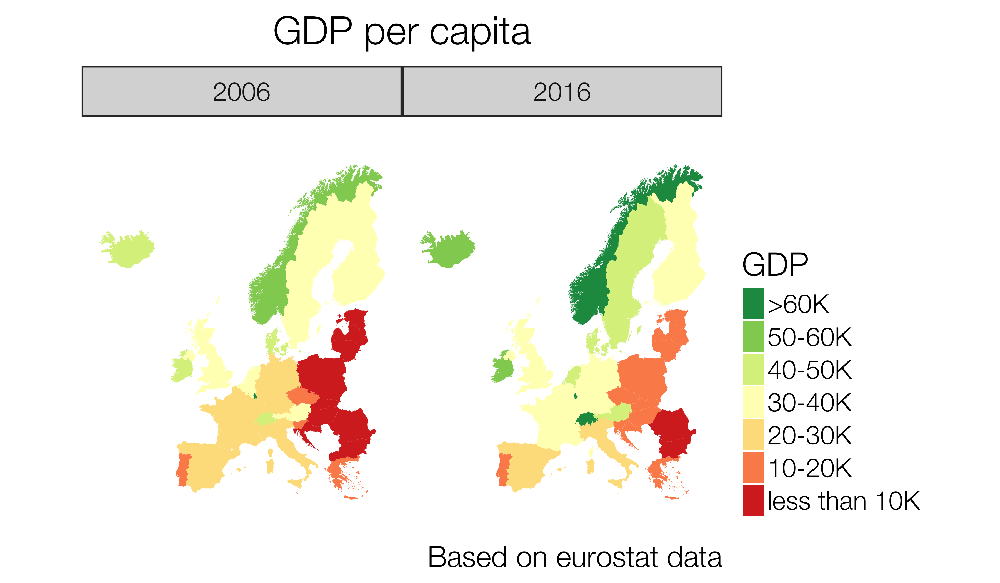
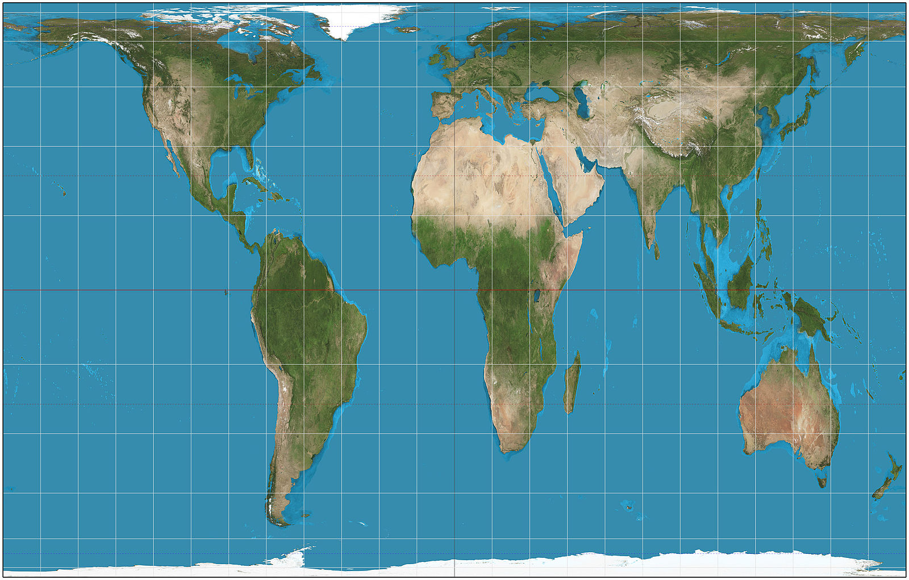
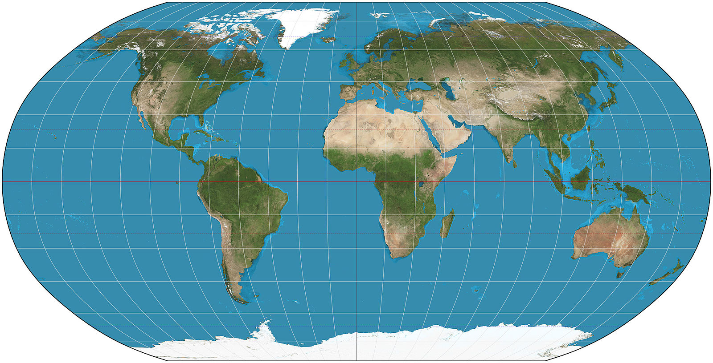

```{r setup, include=FALSE}
knitr::opts_chunk$set(echo = TRUE)
library(dplyr)
```

----

```{r whyR, echo = FALSE, out.width = "800px", fig.align='center'}

```

# Story of making childhood dreams come true

---

* <big>What is a choropleth?</big>

* Where to get (legally) regions shapefiles?

* Drawing maps with ggplot in R

---

## Goal

```{r rysunekPodregiony, echo = FALSE, out.width = "800px", fig.align='center'}

```

---

## Goal

* We want to color of each region to reflect value of some variable (e.g. unemployment, gdp)
* We need a definition of each region...
* ... and a way of joining regions with variables

---

## What is a map and why having flat earth would make our lifes easier

* map is a mathemtical image of a space that projects objects and geografical phenomena in *scale* and 
rectangular *projection*
* set of cartographical signs with a purpose to show geographical objects and phenomena 
* reflects reality in a **specificely  generalized way** – could be treated as a model for a reality

---

### Good old Mercator

```{r rysunekWorldMercator, echo = FALSE, out.width = "650px", fig.align='center'}
knitr::include_graphics("figure/Mercator_projection_SW.jpg")
```

---

### Gall–Peters projection

```{r rysunekWorldGallPeters, echo = FALSE, out.width = "700px, fig.align='center'"}

```


---

### Robinson projection

```{r rysunekWorldRobinson, echo = FALSE, out.width = "700px, fig.align='center'"}

```

---


## Technical note

* Special files, usually shp or gjson. Can be loaded to R using *rgdal* or *sf* packages
* Where to get data from? 
* [Walhkreiseinteilung](https://www.bundeswahlleiter.de/bundestagswahlen/2017/wahlkreiseinteilung/downloads.html)
* [Verwaltungsgemeinschaftsgrenzen](http://data-odiqueensland.opendata.arcgis.com/datasets/402ee65bfe17473692132e0c7808d89d_0)
* [Natural earth](www.naturalearthdata.com) - world map, different scales
* Eurostat (NUTS 1,2,3) 

---

```{r, message=FALSE, warning=FALSE}
require(rgdal) #function readOGR
require(rgeos) #function gSimplify and spTransform
library(ggplot2) #function fortify
```


```{r, message = FALSE, warning = FALSE, cache = TRUE}
EU_NUTS <- readOGR("data/ref-nuts-2013-03m/", layer = "NUTS_RG_03M_2013_3035",
	encoding = "utf8")
#' we need to save the id, since we loose it when transforming into data.frame
EU_NUTS_codes <- data.frame(id = as.character(0:1950), 
	nuts_id = EU_NUTS@data$NUTS_ID, 
	stringsAsFactors = FALSE)
```

---

```{r, message = FALSE, warning = FALSE, cache = TRUE}
#' by simplifying we reduce file size and drawing time
EU_NUTS_simplified <- gSimplify(EU_NUTS, tol = 1000, topologyPreserve = TRUE)
#' changin to mercator (convienent to include eg. localization from google maps)
EU_NUTS_fortified <- spTransform(EU_NUTS_simplified, CRS("+proj=longlat +datum=WGS84"))
EU_NUTS_fortified <- fortify(EU_NUTS_fortified)

#' computing centroids, useful for making labels
centroids_countries = data.frame(gCentroid(EU_NUTS, byid = TRUE))
centroids_countries$id <- rownames((centroids_countries))
```

---

```{r}
glimpse(EU_NUTS_fortified)
```

---

## Let's get some data from eurostat

```{r gettingDataFromEurostat, include=TRUE, eval = TRUE, cache = T}
library(eurostat)
gdp_data <- get_eurostat('tec00001', time_format = "num", stringsAsFactors = F) 
glimpse(gdp_data)
```

--- 

```{r processingEurostatData, include=TRUE, eval = TRUE, cache = T}
gdp_data <- gdp_data %>%
  filter(unit == 'CP_EUR_HAB', nchar(as.character(geo)) == 2) %>%
  mutate(unit = factor(unit))

gdp_data_labels <- label_eurostat(gdp_data, fix_duplicated = T)
glimpse(gdp_data_labels)
```
---

```{r, warning=FALSE}
plot_data <- EU_NUTS_fortified %>%
	inner_join(EU_NUTS_codes, 
						 by = c("id")) %>%
	inner_join(gdp_data, 
						 by = c('nuts_id'='geo'))
glimpse(plot_data)
```

## First attempt {.flexbox .vcenter}

```{r, fig.height = 4, fig.width = 8, warning = FALSE}
plot_data %>%
	filter(time == 2016) %>%
	ggplot(mapping = aes(x = long, y = lat)) +
  geom_polygon(mapping = aes(group = group, fill = values))
```

----


---

## Making a map


```{r, eval = FALSE}
plot_data %>%
	filter(time == 2016) %>%
	ggplot(mapping = aes(x = long, y = lat)) +
	scale_y_continuous(limits = c(33, 72)) +
	scale_x_continuous(limits = c(-25, 32)) +
		#drawing ploygons
  geom_polygon(mapping = aes(group = group, fill = values)) +
    #set coord system
	coord_map() +
		#set colors
  scale_fill_distiller("GDP", palette = "YlGn", 
								breaks = pretty_breaks(n = 6), 
								trans = "reverse") + 
  guides(fill = guide_legend(reverse = TRUE)) + 
	labs(title = "GDP per capita", 
			 caption = "Based on eurostat data") + 
  theme_map(base_size = 18)
```

---

```{r, echo = FALSE, eval = TRUE,  fig.height = 6, fig.width = 10}
library(ggthemes)
library(scales)
plot_data %>%
	filter(time == 2016) %>%
	ggplot(mapping = aes(x = long, y = lat)) +
	scale_y_continuous(limits = c(33, 72)) +
	scale_x_continuous(limits = c(-25, 32)) +
  geom_polygon(mapping = aes(group = group, fill = values)) +
	coord_map() +
  scale_fill_distiller("GDP", palette = "YlGn", 
								breaks = pretty_breaks(n = 6), 
								trans = "reverse") + 
  guides(fill = guide_legend(reverse = TRUE)) + 
	labs(title = "GDP per capita", 
			 caption = "Based on eurostat data") + 
  theme_map(base_size = 18)
```

---

```{r, eval = FALSE, fig.align="top", fig.height = 6, fig.width = 8.5, warning = FALSE}
breaks_gdp = c(0, 10000, 20000, 30000, 40000,50000, 60000, 150000)
labels_gdp = c('less than 10K', '10-20K', '20-30K', '30-40K', '40-50K', '50-60K', '>60K')
plot_data %>%
	mutate(values = cut(values, breaks_gdp, labels = labels_gdp)) %>%
		filter(time %in% c(2006, 2016)) %>%
	ggplot(mapping = aes(x = long, y = lat)) +
	scale_y_continuous(limits = c(33, 72)) +
	scale_x_continuous(limits = c(-25, 32)) +
  geom_polygon(mapping = aes(group = group, fill = values)) + #draw polygons
	coord_map() +  #set coord system
	scale_fill_brewer("GDP", palette = "RdYlGn") +
	facet_wrap(~time, nrow = 1, ncol = 2) +
  guides(fill = guide_legend(reverse = TRUE)) + 
	labs(title = "GDP per capita", 
			 caption = "Based on eurostat data") + 
  theme_map(base_size = 30, base_family = 'Helvetica Neue Light') +
  theme(title = element_text(hjust = 0.5),
  			legend.position="right",
        legend.key.height = unit(1, "cm"),
        legend.key.width = unit(0.7, "cm"))
```

---

```{r, echo = FALSE, eval = TRUE, fig.align="top", fig.height = 6.5, fig.width = 9, warning = FALSE}
breaks_gdp = c(0, 10000, 20000, 30000, 40000,50000, 60000, 150000)
labels_gdp = c('less than 10K', '10-20K', '20-30K', '30-40K', '40-50K', '50-60K', '>60K')
plot_data %>%
	mutate(values = cut(values, breaks_gdp, labels = labels_gdp)) %>%
		filter(time %in% c(2006, 2016)) %>%
	ggplot(mapping = aes(x = long, y = lat)) +
	scale_y_continuous(limits = c(33, 72)) +
	scale_x_continuous(limits = c(-25, 32)) +
		#draw polygons
  geom_polygon(mapping = aes(group = group, fill = values)) +
    #set coord system
	coord_map() +
	scale_fill_brewer("GDP", palette = "RdYlGn") +
	facet_wrap(~time, nrow = 1, ncol = 2) +
  guides(fill = guide_legend(reverse = TRUE)) + 
	labs(title = "GDP per capita", 
			 caption = "Based on eurostat data") + 
  theme_map(base_size = 28, base_family = 'Helvetica Neue Light') +
  theme(plot.title = element_text(hjust = 0.5),
  			legend.position="right",
        legend.key.height = unit(1, "cm"),
        legend.key.width = unit(0.7, "cm")) 
```

---

### Cartograms

```{r, cache = TRUE, message=FALSE}
library(Rcartogram)
library(getcartr)
gdp_2016 <- filter(gdp_data, time == 2016)
EU_NUTS_countries <- EU_NUTS[EU_NUTS$LEVL_CODE == 0 & EU_NUTS$NUTS_ID %in% gdp_2016$geo,]
EU_NUTS_countries@data <- EU_NUTS_countries@data %>%
  inner_join(gdp_2016, by = c('NUTS_ID'='geo'))
EU_NUTS_cartogram <- quick.carto(spdf = EU_NUTS_countries, v = EU_NUTS_countries@data$values)
```

---

```{r, message=FALSE, warning=FALSE}
plot_data2 <- inner_join(fortify(EU_NUTS_cartogram), EU_NUTS_codes, 
											 by = c("id")) %>%
	inner_join(gdp_2016, by = c('nuts_id'='geo'))
```

---

```{r, echo = FALSE, eval = TRUE, fig.align="top", fig.height = 6.5, fig.width = 9, warning = FALSE}
breaks_gdp = c(0, 10000, 20000, 30000, 40000,50000, 60000, 150000)
labels_gdp = c('less than 10K', '10-20K', '20-30K', '30-40K', '40-50K', '50-60K', '>60K')
plot_data2 %>%
	mutate(values = cut(values, breaks_gdp, labels = labels_gdp)) %>%
	ggplot(mapping = aes(x = long, y = lat)) +
	scale_y_continuous(limits = c(65, 105)) +
	scale_x_continuous(limits = c(50, 87)) +
		#rysujemy wielokąty
  geom_polygon(mapping = aes(group = group, fill = values)) +
  # for cartogram we need to use fixed coord
	coord_fixed() +
		#ustalamy paletę kolorów i skalę
  scale_fill_brewer("GDP", palette = "RdYlGn") +
  guides(fill = guide_legend(reverse = TRUE)) + 
	labs(title = "GDP per capita", 
			 caption = "Based on eurostat data") + 
		#sugerowany styl wyglądu mapy
  theme_map(base_size = 30, base_family = 'Helvetica Neue Light') +
  theme(legend.position="right",
        legend.key.height = unit(1, "cm"),
        legend.key.width = unit(0.8, "cm"))
```


# Tips and tricks

---

* (relatively) new package **sf** - no need for playing with codes, tidyverse support
* Finding the right projection **proj4string(OBJECT_FROM_SHP)**
* Placing legend 'inside plot' **theme(legened.position = c(0.1,0.1))**
* Adding labels to polygons **geom_label**
