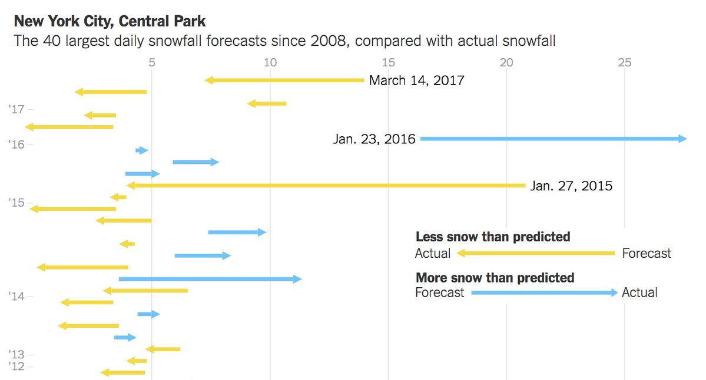
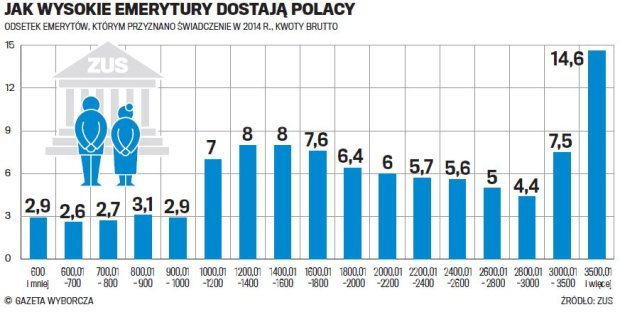
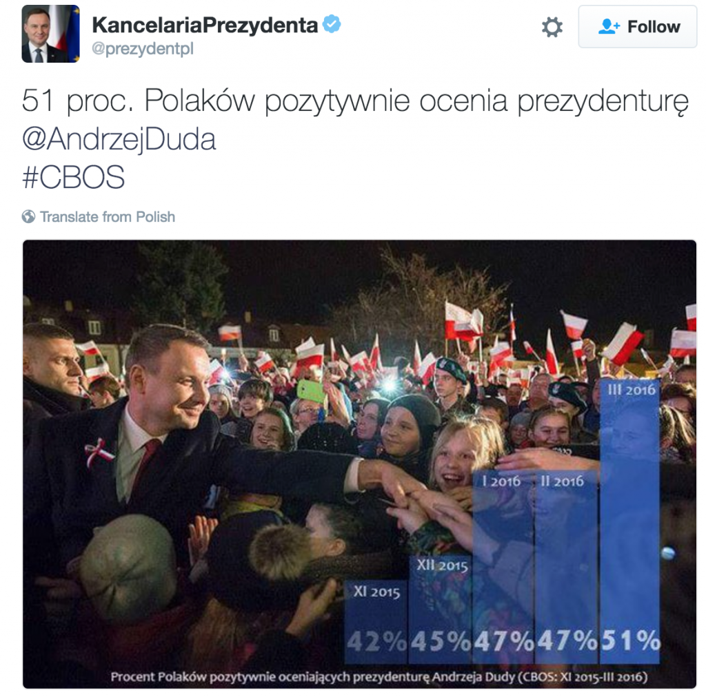
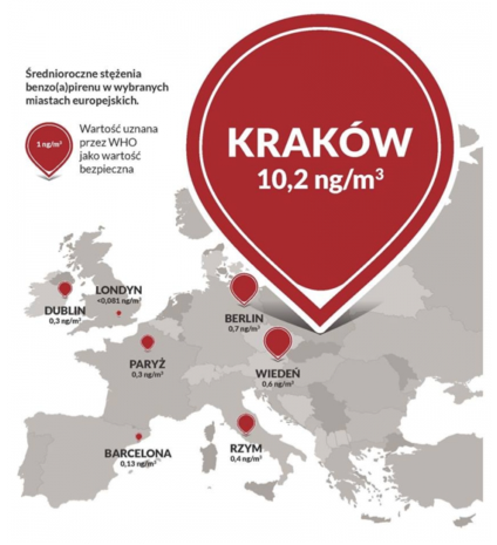

<style>
.title-slide {
  background-color: #FFFFFF; /* #EDE0CF; ; #CA9F9D*/
}
article li {
  font-size: 27px;
  line-height: 160%;
}
</style>

## Motywacja

```{r, echo=FALSE, message=FALSE, warning=FALSE, cache=FALSE}
library(dplyr)
library(ggplot2)
library(extrafont)
font_import(prompt = "FALSE", pattern = "compacta")
```

<div style='text-align: center;'>
    
</div>


--- &twocol w1:50% w2:50%

## Po co wizualizacja?

*** =left

> * <b>Użyteczność</b>: podejmowanie decyzji w oparciu o dane
> * <b>Maksymalizacja wpływu</b>: obraz jako medium wyników analizy 
> * <b>Estetyka</b>

*** =right

<!--
<div style='text-align: center;'>
    
</div>
-->

<div style='text-align: center;'>
    
</div>


--- .segue .quote .dark

<q> Tak więc estetyka może być pomocna w życiu <br> nie należy zaniedbywać nauki o pięknie</q>

<style>
.dark q {
  color: white;
  text-align:center;
}
</style>

--- bg:#FFF
## Jak zabieramy się za wizualizację?

> * Chcemy opowiedziec pewną historię, wizualizacja jest środkiem wyrazu
> * Notka PAP czy pobłębiona analiza?
> * Książka kucharska czy ,,Czarodziejska Góra"?
> * Strona techniczna

--- bg:#FFF
## Dobra wizualizacja

<!--https://pbs.twimg.com/media/C7DFVTgVwAUabFO.jpg-->

<div style='text-align: center;'>
    
</div>

--- bg:#FFF
## Dobra wizualizacja

> * Jasny, zapadający w pamięć przekaz
> * Dopasowana do odbiorców (czytelnicy gazet, współpracownicy, kierownicy)
> * Dopasowana do sytuacji w jakiej będą odbierane
> * Wywieraja wpływ, przekazuje wiedzę, poszerza świadomość

<div style='text-align: center;'>
    
</div>

--- bg:#FFF
## Zła wizualizacja

<div style='text-align: center;'>
    
</div>

--- bg:#FFF
## Zła wizualizacja

<!-- http://smarterpoland.pl/wp-content/uploads/2017/01/z19705009QJak-wysokie-emerytury-dostaja-Polacy-.jpg -->

> * Celowo wprowadza w błąd odbiorcę
> * Przesycona zbędnymi informacjami
> * Niedokładna

<div style='text-align: center;'>
    
</div>

--- bg:#FFF
## Zła wizualizacja

<!--http://smarterpoland.pl/wp-content/uploads/2017/01/Screen-Shot-2016-12-25-at-23.40.46-1024x1012.png -->
<div style='text-align: center;'>
    
</div>


--- bg:#FFF
## Brzydka wizualizacja

<!--http://smarterpoland.pl/wp-content/uploads/2017/01/Screen-Shot-2016-12-25-at-23.13.38.png -->
<div style='text-align: center;'>
    
</div>

--- &twocol w1:50% w2:50%
## Brzydka wizualizacja

*** =left

> * Trudna w interpretacji
> * Niecelowo wprowadzająca w błąd
> * Zawiera zbędne i nudne informacje

*** =right
<!--http://smarterpoland.pl/wp-content/uploads/2017/01/Screen-Shot-2016-12-25-at-23.13.38.png -->
<div style='text-align: center;'>
    
</div>

--- bg:#FFF
## Case study

> * Dane dotyczące PKB na mieszkańca i ludności na świecie
> * Chcemy pokazać nierówności społeczne
> * Dane pochodzą z serwisu gapminder https://www.gapminder.org


--- bg:#FFF
## Kolory

> * Wyróżnienie informacji, umożliwienie rozpoznania grup
> * Dobór palety barw odpowiedniej do danych
> * Symulator schorzeń wzroku, np. http://www.color-blindness.com/coblis-color-blindness-simulator/


--- bg:#FFF
## Wybór palety barw 

```{r, echo=FALSE, cache=FALSE}
library(RColorBrewer)
display.brewer.all()
```


--- bg:#FFF
## Wybór palety barw 

> * Skala ilościowa (uporządkowana)
> * Skala uporządkowana rozbieżna (z elementem neutralnym)
> * Skala jakościowa (nieuporządkowana)


--- bg:#FFF
## Wybór palety barw 

```{r, echo=FALSE, warning=FALSE, cache = FALSE}
library(maptools)
library(ggplot2)
library(ggthemes)
```


```{r, echo=FALSE, warning=FALSE, fig.height=7.5, fig.width=12, message=FALSE, fig.align='center'}
load("danePkb.Rdata")
dane %>% filter(year %in% c(2013))  %>%
	inner_join(metadata, by=c("country"="Country.Name"))  %>% 
	select(-SpecialNotes) -> dane2013

data(wrld_simpl)
wrld_simpl@data <- left_join(wrld_simpl@data, dane2013, by = c("ISO3"="Country.Code"))

worldFortified <- fortify(wrld_simpl) 
worldFortified <- worldFortified %>%
	inner_join(wrld_simpl@data, by = c("id" = "ISO3"))
ggplot(worldFortified, aes(x = long, y = lat, group = group, fill = pkbPerCapita)) +
	geom_polygon() +
	theme_map(base_size = 18) +
		guides(fill = guide_legend(override.aes = aes(size=12)))
```

--- bg:#FFF
## Wybór palety barw 
```{r, echo=FALSE, warning=FALSE, fig.height=7.5, fig.width=12, message=FALSE, fig.align='center', cache=TRUE}
ggplot(worldFortified, aes(x = long, y = lat, group = group, fill = pkbPerCapita)) +
	geom_polygon() +
	theme_map(base_size = 18) +
	scale_fill_continuous_tableau() +
		guides(fill = guide_legend(override.aes = aes(size=14)))
```

--- bg:#FFF
## Wybór palety barw 
```{r, echo=FALSE, warning=FALSE, fig.height=7.5, fig.width=12, message=FALSE, fig.align='center', cache=FALSE}
ggplot(worldFortified, aes(x = long, y = lat, group = group, fill = cut(pkbPerCapita, scales::pretty_breaks(6)(pkbPerCapita)))) +
	geom_polygon() +
	theme_map(base_size = 18) +
	scale_fill_brewer(name = "", type = "qual", palette = 1, na.value = "Gray90") +
	guides(fill = guide_legend(override.aes = aes(size=12)))
```

--- bg:#FFF
## Wybór palety barw 
```{r, echo=FALSE, warning=FALSE, fig.height=7.5, fig.width=12, message=FALSE, fig.align='center', cache=FALSE}
ggplot(worldFortified, aes(x = long, y = lat, group = group, fill = cut(pkbPerCapita, scales::pretty_breaks(6)(pkbPerCapita)))) +
	geom_polygon() +
	theme_map(base_size = 18) +
	scale_fill_brewer(name = "", type ="seq", palette = 2, na.value = "Gray90") +
	guides(fill = guide_legend(override.aes = aes(size=12)))
```

--- bg:#FFF
## Wybór palety barw 
```{r, echo=FALSE, warning=FALSE, fig.height=7.5, fig.width=12, message=FALSE, fig.align='center', cache=FALSE}
breaks = c(0, 5000, 10000, 15000, 20000, 25000, 30000, 35000, 130000)
ggplot(worldFortified, aes(x = long, y = lat, group = group, fill = cut(pkbPerCapita, breaks))) +
	geom_polygon() +
	theme_map(base_size = 18) +
	scale_fill_brewer(name = "", type ="div", palette = 1, na.value = "Gray90") +
		guides(fill = guide_legend(override.aes = aes(size=12)))
```

--- bg:#FFF
## Sposób przedstawienia danych

> * Te same dane można przedstawić na wiele sposobów
> * Jaki cel chcemy osiągnąć?

--- bg:#FFF
## Sposób przedstawienia danych

```{r, echo=FALSE, warning=FALSE, fig.height=7.5, fig.width=12, message=FALSE, fig.align='center', cache=FALSE}
ggplot(dane2013, aes(x = population, y = pkbPerCapita)) +
	geom_point()
```

--- bg:#FFF
## Sposób przedstawienia danych - odpowiednia skala

```{r, echo=FALSE, warning=FALSE, fig.height=7.5, fig.width=12, message=FALSE, fig.align='center', cache=FALSE}
ggplot(dane2013, aes(x = population, y = pkbPerCapita)) +
	geom_point() +
	scale_x_log10() +
	scale_y_log10()
```

--- bg:#FFF
## Sposób przedstawienia danych - kształt, kolor, rozmiar punktów

```{r, echo=FALSE, warning=FALSE, fig.height=6.5, fig.width=12, message=FALSE, fig.align='center', cache=FALSE}
ggplot(dane2013, aes(x = population, y = pkbPerCapita, color = Region, size = population)) +
	geom_point() +
	scale_x_log10() +
	scale_y_log10()
```

--- bg:#FFF
## Sposób przedstawienia danych - kształt, kolor, rozmiar punktów

```{r, echo=FALSE, warning=FALSE, message=FALSE,cache=FALSE,results='asis'}
library(highcharter)
library(htmlwidgets)

hch <- hchart(dane2013, "scatter", mapping = hcaes(x = population, y = pkbPerCapita, color = Region, name = country, group = Region)) %>%
	hc_yAxis(
    title = list(text = "PKB per capita"),
    type = 'logarithmic'
  )  %>%
	hc_xAxis(
    title = list(text = "Ludność"),
    type = 'logarithmic'
  ) %>%
	hc_tooltip(pointFormat = "<b>{point.name}</b><br>
						 <b>Ludność</b>: {point.x:,.0f}<br>
						 <b>PKB per capita</b>: {point.y:,.0f}")
saveWidget(hch, 'diagram.html')
cat('<iframe src="diagram.html" width=100% height=100% allowtransparency="true"> </iframe>')
```


--- bg:#FFF
## Inaczej

```{r, echo=FALSE, warning=FALSE, fig.height=6, fig.width=12, message=FALSE, fig.align='center', cache=TRUE}
dane2013 %>% group_by(year) %>% arrange(pkbPerCapita) %>% 
	mutate(cumulativeppp=cumsum(ppp),
				 cumulativepopulation=cumsum(population),
				 cumulativeppp=cumulativeppp/max(cumulativeppp, na.rm = T),
				 cumulativepopulation=cumulativepopulation/max(cumulativepopulation,na.rm = T)) %>%
	filter(!is.na(cumulativeppp)) %>%
	mutate(aveppp=(cumulativeppp+c(0,head(cumulativeppp,-1)))/2,
				 avepop=(cumulativepopulation+c(0,head(cumulativepopulation,-1)))/2,
				 minppp=c(0,head(cumulativeppp,-1)),
				 minpop=c(0,head(cumulativepopulation,-1))) -> danePlot

countriesToPlot=c("Ethiopia", "Poland", "India", "United States", "China", "Mexico",
									"United Arab Emirates")
danePlot %>% filter(country %in% countriesToPlot) -> labelPlotData
labelPlotData %>% mutate(country=factor(country, labels = c("Chiny", "Etiopia",  "Indie", 
																														"Meksyk",  "Polska", "ZEA",
																														"USA"))) ->
	labelPlotData

levels(danePlot$Region) <- c( "", "Azja Wschodnia i Pacyfik", "Europa i Azja Środkowa",   
															"Ameryka Łacińska",  "Bliski Wschód i Afryka Północna", 
															"Ameryka Północna", "Azja Południowa", "Afryka Sub-Saharyjska")
```

```{r, echo=FALSE, warning=FALSE, fig.height=8, fig.width=14, message=FALSE, fig.align='center', cache=TRUE}
ggplot(danePlot, aes(x=avepop, y=pkbPerCapita)) +
	geom_point(aes(color=Region, group=year, size = population)) +
	geom_label_repel(data = labelPlotData, aes(x=avepop, y=pkbPerCapita, label=country)) +
	scale_x_continuous("Procent populacji świata", 
										 breaks = seq(0, 1, .25),
										 labels = paste0(seq(0, 100, 25), "%"), 
										 expand = c(0,0.01)) +
	scale_y_continuous("PKB per capita") +
	scale_color_brewer(type = "qual", palette = "Set1") +
 	theme_tufte(base_size = 19) +
	ggtitle("Nierówności bogactwa w roku 2013") +
	theme(title=element_text(size=25)) 
```


--- bg:#FFF

```{r, echo=FALSE, warning=FALSE, message=FALSE,cache=FALSE,results='asis'}
hch <- hchart(danePlot, "scatter", mapping = hcaes(x = avepop, y = pkbPerCapita, color = Region, name = country, group = Region,
																									 size = population)) %>%
	hc_yAxis(
    title = list(text = "PKB per capita"),
    type = 'linear'
  )  %>%
	hc_xAxis(
    title = list(text = "Procent ludność świata"),
    type = 'linear'
  ) %>%
	hc_tooltip(pointFormat = "<b>{point.name}</b><br>
						 <b>Ludność</b>: {point.size:,.0f}<br>
						 <b>PKB per capita</b>: {point.y:,.0f}")
saveWidget(hch, 'uszeregowane_pkb.html')
cat('<iframe src="uszeregowane_pkb.html" width=100% height=100% allowtransparency="true"> </iframe>')
```

--- bg:#FFF

```{r, echo=FALSE, warning=FALSE, fig.height=8, fig.width=14.7, message=FALSE, fig.align='center', cache=FALSE}
ggplot(danePlot, aes(x=cumulativepopulation, y=cumulativeppp)) +
	geom_segment(aes(xend=cumulativepopulation, yend=cumulativeppp,
									 x=minpop, y=minppp,
									 color=Region, group=year), size=2, lineend="square") +
	geom_label_repel(data = labelPlotData, aes(x=avepop, y=aveppp, label=country)) +
	scale_x_continuous("Procent populacji świata", 
										 breaks = seq(0, 1, .25),
										 labels = paste0(seq(0, 100, 25), "%"), 
										 expand = c(0,0.01)) +
	scale_y_continuous("Procent łącznego PKB", 
										 breaks = seq(0, 1, .25),
										 labels = paste0(seq(0, 100, 25), "%"),
										 expand = c(0, 0.01)) +
	scale_color_brewer(type = "qual", palette = "Set1") +
 	theme_tufte(base_size = 19) +
	ggtitle("Nierówności bogactwa w roku 2013") +
	theme(plot.title=element_text(size = 25, hjust = 0.5)) -> p

p +	geom_segment(aes(x=0, xend=1, y=0, yend=1), linetype="dotted", color="gray80") +
	geom_segment(aes(x=0.4, xend=0.9, y=0.4, yend=0.9), color="gray20",
								 arrow=arrow(angle = 25, length = unit(0.4, "cm"))) +
	annotate("text", x=0.42, y=0.44, angle = 33, hjust=0, vjust=0, size=4, 
					 label="Państwa uszeregowane według PKB na mieszkańca") -> p2

p2 +	geom_segment(aes(x=0, xend=0.508, y=0.1834, yend=0.1834), linetype="dotted", color="gray20",
								 arrow=arrow(angle = 25, ends = "both", length = unit(0.4, "cm"))) +
	annotate("text", x=0.25, y=0.25, size=4.5, label="Połowa ludności świata\njest biedniejsza od Chińczyków") +
	geom_segment(aes(x=0.508, xend=0.508, y=0, yend=0.1834), linetype="dotted", color="gray20", 
							 arrow=arrow(angle = 25, ends = "both", length = unit(0.4, "cm"))) +
	annotate("text", x=0.65, y=0.1, size=4.5, label="Połowa ludności świata\n wytwarza 18% PKB")
```

--- bg:#FFF
## Źródła

* Przemysław Biecek, ,,Odkrywać, Ujawniać, Objaśniać! Zbiór esejów o sztuce prezentowania danych", 2014
* Edward Tufte, ,,Beautiful evidence"
* Gapminder, https://www.gapminder.org
* Symulator schorzeń wzroku http://www.color-blindness.com/coblis-color-blindness-simulator/
* https://www.r-bloggers.com/data-visualization-part-1/
* https://lisacharlotterost.github.io/2016/04/22/Colors-for-DataVis/
* Szychta w danych, www.szychtawdanych.pl
* pakiety: **ggplot2**, **highcharter**
