# Introduction

## About me 


- statistician/data analyst/data scientist
- R enthusiast
- working @OLX in Berlin
- www.szychtawdanych.pl
- https://github.com/psobczyk
- blog in english on github pages (very early stage)


##  {data-background-iframe="http://szychtawdanych.pl"}

## Why Szychta?

- Creative procrastination from PhD
- How things really are? 
- Poland should have discussion based on data, not ideology or party 

## Good practice 

- [FiveThirtyEight](https://fivethirtyeight.com)
- [WSJ](https://graphics.wsj.com)
- [South China Morning Post](https://www.scmp.com/infographics)
- [Economist](https://www.economist.com/node/21011894)
- [BIQData](http://biqdata.wyborcza.pl/biqdata/0,0.html)

## Topics of interest

- Demography
- Politics
- Economy 
- Sports 

## Topics of interest

```{r echo = FALSE, out.width = "700px, fig.align='center'"}
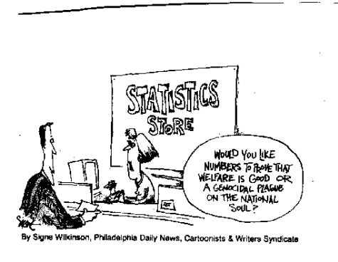
```

# Data sources

## Governmental data

- [Local data bank](https://bdl.stat.gov.pl/BDL/start)
- [Baza demografia](http://demografia.stat.gov.pl/bazademografia/)
- [Główny urząd Geodezji i Kartografii](http://www.gugik.gov.pl/pzgik/dane-bez-oplat/dane-z-panstwowego-rejestru-granic-i-powierzchni-jednostek-podzialow-terytorialnych-kraju-prg)
- [Open data](https://dane.gov.pl)
- [Główny Inspektorat Ochrony Środowiska](http://powietrze.gios.gov.pl/pjp/archives), [Bank danych o lasach](https://www.bdl.lasy.gov.pl/portal/udostepnianie)
- [Instytut Meteorologii i Gospodarki Wodnej](https://dane.imgw.pl)
- [Państwowa komisja wyborcza](https://pkw.gov.pl/316_Wybory_do_Parlamentu_Europejskiego)


## Non-govermental data sources 

- [Data shared by cities](https://www.wroclaw.pl/open-data/dataset)
- [OpenStreetMap](https://download.geofabrik.de)
- Google Maps (distance, geolocalization)
- [Eurostat](https://ec.europa.eu/eurostat/data/database)
- [Natural Earth](https://www.naturalearthdata.com/downloads/) - free vector and raster world maps
- [OECD](https://data.oecd.org)
- [World bank](https://data.worldbank.org)

## Non-govermental data sources 

- Kaggle, [UCI Machine Learning repository](https://archive.ics.uci.edu/ml/index.php)
- Data from scraping (try *rvest* and *RSelenium* packages)
- Wikipedia
- [Gutenberg project](https://www.gutenberg.org), [Wolne lektury](https://wolnelektury.pl/katalog/lektury/)
- Social media (mostly twitter)
- Private data: Google localization, WhatsApp, Messenger etc.

## Data difficult to get

- Postal code
- Train timetables
- Very detailed demographics data (available, but one has to request it and pay for it)
- Crime data 


# What can we actually do with that data?

## Technical note

- [Maps](https://github.com/psobczyk/whyR_2018_workshop)
- [Useful tips](https://github.com/WhyR2017/prezentacje/tree/master/03_Tidyverse/5)
- [Codes for blog posts](https://github.com/psobczyk/szychtawdanych)

# Demographics {data-transition="zoom"}


## True fertility rate in Poland

```{r echo = FALSE, out.width = "760px, fig.align='center'"}
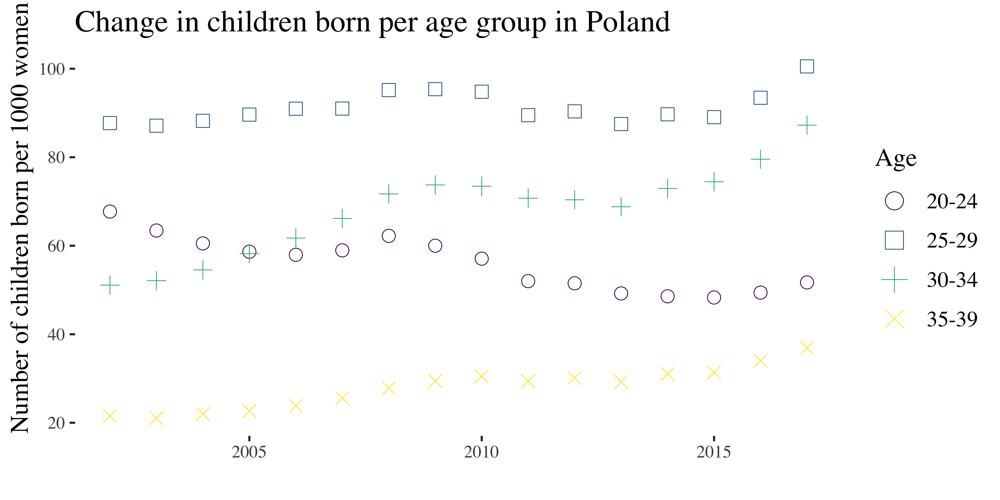
```

- Total fertility rate = Expected number of children born by a woman throughout her life

- $$\frac{\text{births at age 15}}{\text{woman at age 15}} + \frac{\text{births at age 16}}{\text{woman at age 16}} + 
\dots + \frac{\text{births at age 45}}{\text{woman at age 45}}$$


## 

- Let us consider group of woman of age 20-24 in 2002
- Fertility rate in 2002 was 1.24. In reality those woman gave birth to 1.33
- In modern times births are calculated very precisely...
- ... but in the last 15 years more than [2.5 million](https://tvn24bis.pl/z-kraju,74/gus-ponad-2-5-mln-polakow-na-emigracji,781794.html) Poles emigrated

##

- $$\frac{\text{births at age 15}}{\text{woman at age 15}} + \frac{\text{births at age 16}}{\text{woman at age 16}} + 
\dots + \frac{\text{births at age 45}}{\text{woman at age 45}}$$
- Only some emigrants deregistered in Poland, but their children are born abroad 
- In UK in 2017 for 900K Poles 20K children were born. In Germany for 687K Poles 12K children were born
- Total fertility rate is not 1.48 but rather 1.65


##

```{r echo = FALSE, out.width = "800px, fig.align='center'"}
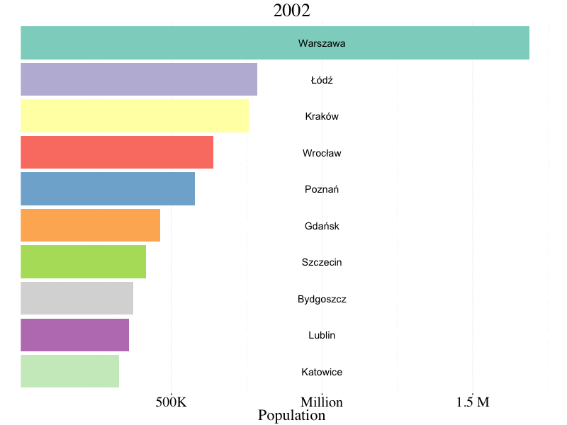
```

## Suburbanization

```{r echo = FALSE, out.width = "800px, fig.align='center'"}
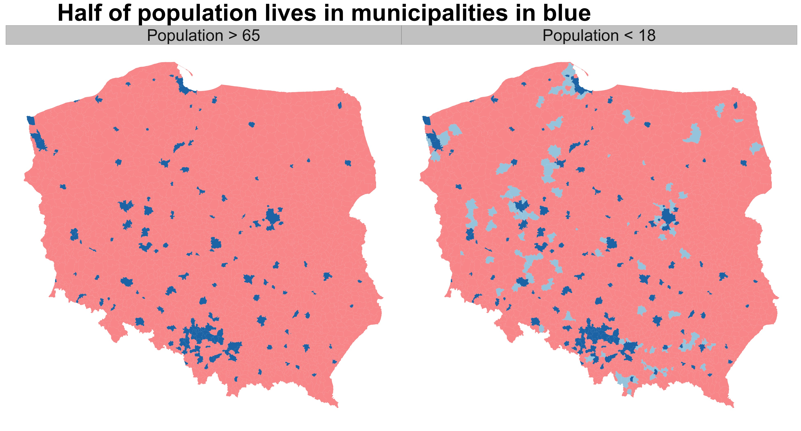
```

##

```{r echo = FALSE, out.width = "800px, fig.align='center'"}
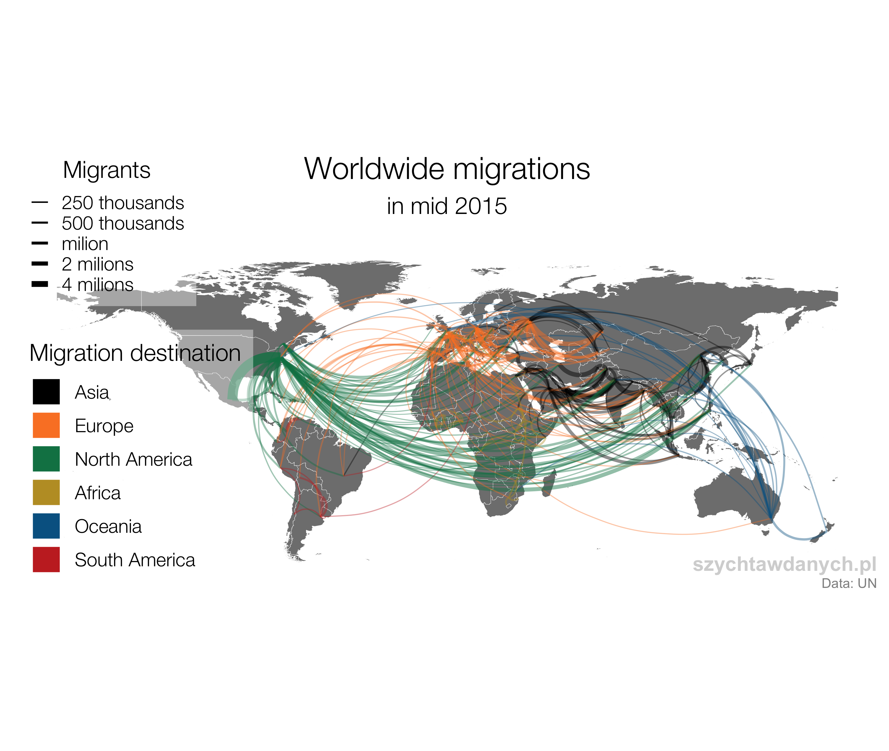
```

# Economics {data-transition="zoom"}

## 

```{r echo = FALSE, out.width = "800px, fig.align='center'"}
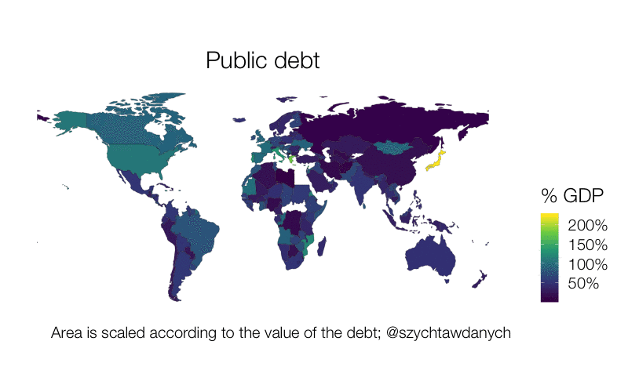
```


## 

```{r echo = FALSE, out.width = "800px, fig.align='center'"}
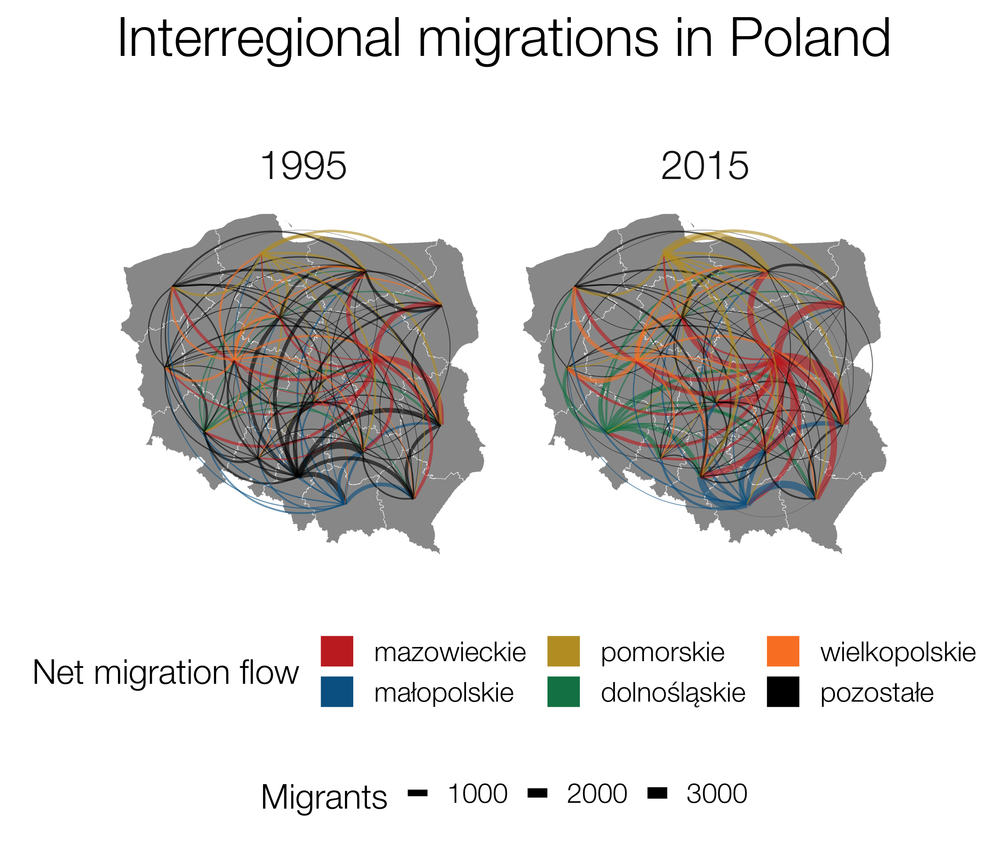
```

## World inequalities

```{r echo = FALSE, out.width = "800px, fig.align='center'"}
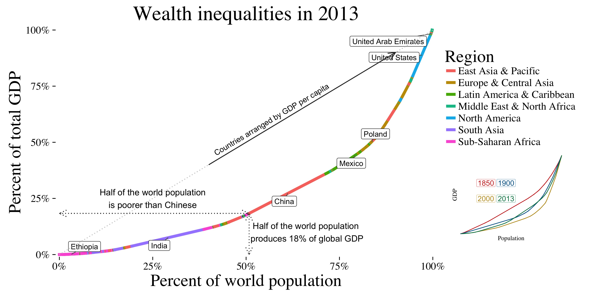
```

## 

```{r echo = FALSE, out.width = "900px, fig.align='center'"}
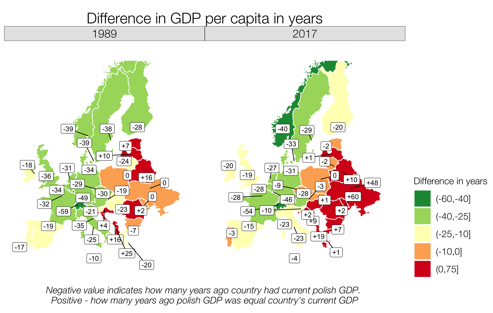
```


# Politics {data-transition="zoom"}	

## Effect of electoral system on European Parliament elections


```{r echo = FALSE, out.width = "800px, fig.align='center'"}
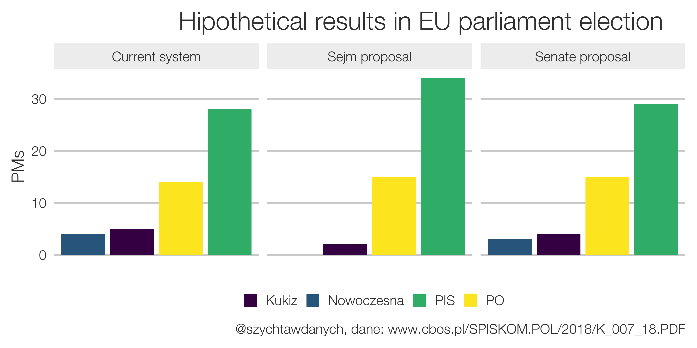
```

##

```{r echo = FALSE, out.width = "700px, fig.align='center'"}
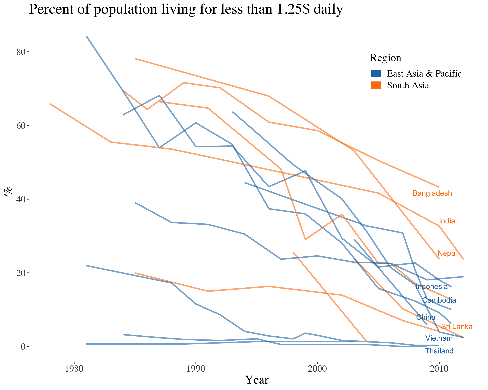
```

- Highly recommended book: Factfulness

# Miscellaneous

## 

```{r echo = FALSE, out.width = "800px, fig.align='center'"}
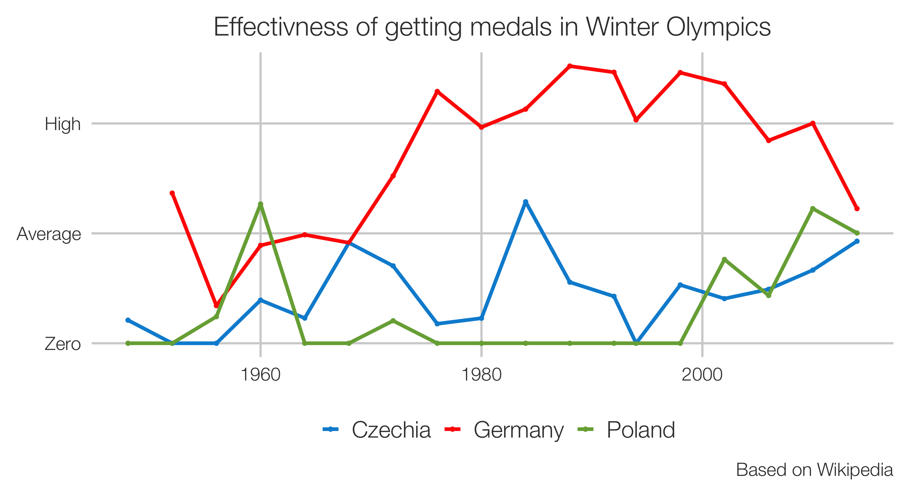
```

## 

```{r echo = FALSE, out.width = "800px, fig.align='center'"}
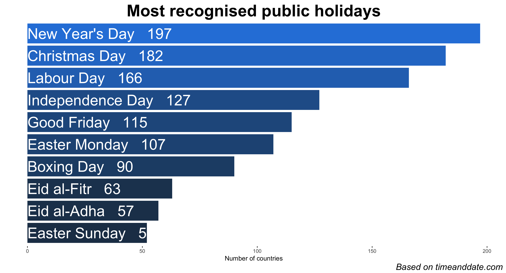
```

## 

```{r echo = FALSE, out.width = "800px, fig.align='center'"}
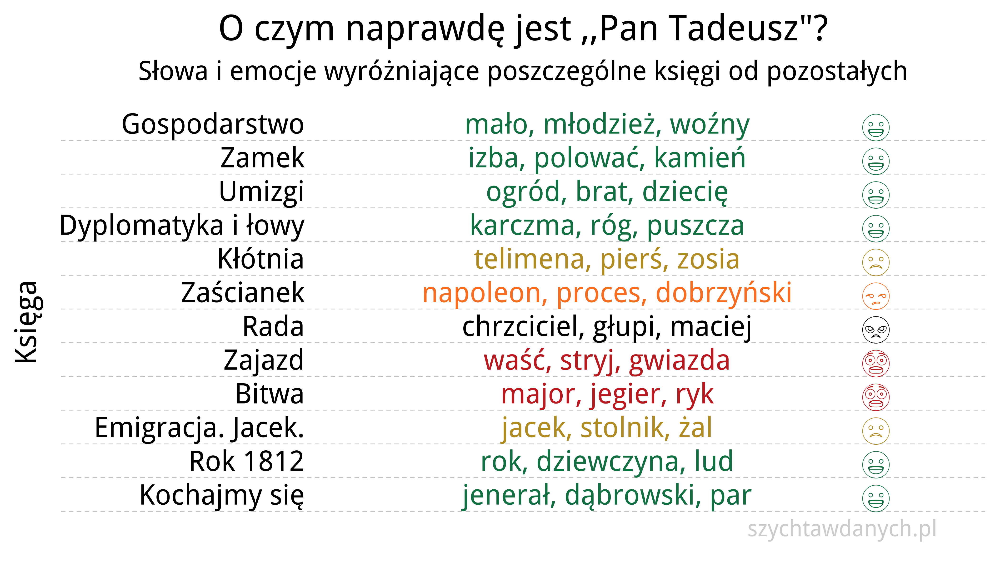
```

## Book(let) "Wykresy unplugged"

```{r echo = FALSE, out.width = "700px, fig.align='center'"}
knitr::include_graphics("~/Downloads/booklet.png")
```

# Wrap up

##  {data-background="img/szychta_logo_duze.jpg" data-background-size="600px" data-background-position="bottom left"}

- <font size="8">[szychtawdanych.pl](www.szychtawdanych.pl) </font>
- <font size="8">[facebook.com/szychtawdanych/](https://www.facebook.com/szychtawdanych/)</font>