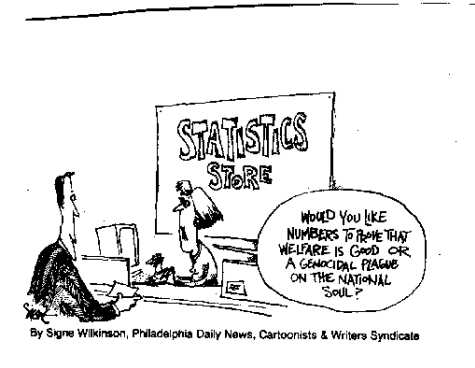

## About me

- statistician/data analyst/data scientist
- R enthusiast
- working @OLX in Berlin
- www.szychtawdanych.pl
- https://github.com/psobczyk
- blog in english on github pages (very early stage)

## Why ,,szychta"? 

- Creative procrastination from PhD
- How things really are? 
- Poland should have discussion based on data, not ideology or party 

	
## Topics of interest

- Demographics
- Politics
- Economy 

## Topics of interest

# Data analysis cookbook

- Get the data 
- Perform analysis
- Visualize results
- Thank you dr Obvious

## Getting the data

- Easier than you think :) 

Nie zawsze jest proste, ale jestem pewny, że jest więcej dostępnych zbiorów danych niż sobie wyobrażacie. 
Bardzo dużo danych udostępnia GUS - głównie bank danych lokalnych. Ale też baza demografii. Kontury map można pobrać z Centralnego Urzeędu Kartografii (sprawdzić nazwę). Do tego coraz więcej danych udostępnia Ministerstwo Cyfryzacji na platformie dane publiczne. Urzędy centralne - GIOŚ - jakość powietrza, pomniki przyrody. Miasta - komunikacja miejska (też live), pogoda, smog, dane przestrzenne, szkoły etc. PKW - wyniki wyborów, kandydaci

## Non-govermental data sources

- openstreetmap (można ściągnąć wszystkie podkłady)
- google maps (odległości, geolokalizacja)
- pogoda (czasem trzeba płacić, ale często aktualne wartości są za darmo)
- eurostat - kopalnia wiedzy + dokładna mapa Europy w podziale na regiony statystyczne
- natural earth - mapa świata
- media społecznościowe (na pewno da się łatwo dosta dane z twittera)
- miejsca w których się było google

## Data difficult to get

- Postal code
- Train timetables
- Very detailed demographics data (available, but one has to request it and pay for it)
- Crime data 

# What can we actually do with that data?

# Demographics

## True fertility rate in Poland

What is fertility rate? Expected number of children born per one woman throughout her life

$$\frac{\text{births at age 15}}{\text{woman at age 15}} + \frac{\text{births at age 16}}{\text{woman at age 16}} 
\dots \frac{\text{births at age 45}}{\text{woman at age 45}}$$

## 

- Note a change in time true fertifility rate of cohort of woman of age 20-24 in 2004
- Fertility rate in 2002 was 1.24. In reality those woman gave birth to 1.33
- Or even more...

##

- in modern times births are calculated very precisely (needs to be registered)
- but in the last 15 years more than (2.5 million)[https://tvn24bis.pl/z-kraju,74/gus-ponad-2-5-mln-polakow-na-emigracji,781794.html] Poles emigrated
- few deregister in Poland
- we shall estimate true one based on data from UK and Germany

# Economics 

## Economic strength measured with migrations

Connected to demographics - migrations - true indicator of regions economic strength.
- osmosis people come from poor regions to more wealthy looking for jobs. Change in Poland is huge in 20 years. One can see which are succesful and which are not

# Politics

## Electoral system

Effect of electoral system on european parliament elections
http://szychtawdanych.pl/?p=1978

## General elections simulation

And simulation of general elections based on voivodeship elections. Evaluate the efficiency of grand coalition against ruling party.

Blog, href: "http://szychtawdanych.pl/",
Github, href: "https://github.com/psobczyk"

# Book(let) "Wykresy unplugged"

# Thank you
