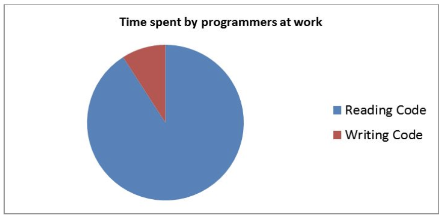

```{r setup, include=FALSE}
knitr::opts_chunk$set(echo = FALSE)
```

## Dwa słowa o sobie

> - Data Scientist, OLX Group
> - Szychta w danych
> - STowarzyszenie Wrocławskich Użytkowników R - STWUR
> - Dimensionality reduction; Model selection; Graphical models; Secretory signal peptide; Amyloidogenic polipeptides

# Agenda


## Co chcę Wam przekazać

> - czym są pakiety?
> - czemu warto trzymać kod w pakietach i jak to zrobić
> - jak zadbać o porządek w kodzie

# Czym są pakiety

## 

> - kod++
> - oprogramowanie, którym łatwo można się dzielić
> - ,,ujarzmienie natury"
> - [R packages, Hadley Wickham](http://r-pkgs.had.co.nz/).
> - [Writing R Extensions](https://cran.r-project.org/doc/manuals/r-release/R-exts.html).
> - [tutorial Jeffa Leeka](https://github.com/jtleek/rpackages/)

## Zawartość pakietu


Źródło: R packages, Hadley Wickham. 

## Czy pakiety są konieczne?

> - Nie, ale...
> - czy ktoś użyje kodu, który piszesz?
> - czy ktoś będzie czytać kod, który piszesz?

> - Czyli zamiast tworzenia pakietów można utrzymywać porządek w kodzie?
> - Pakiety tworzy się właśnie w tym celu! Chodzi o to, żeby samemu nie zgubić się w swoim kodzie oraz żeby inni mogli z naszego kodu skorzystać


## Demo - pkgKitten

## Co powininen mieć pakiet?

- `pkgKitten::kitten("NAME", "PATH")`
- `usethis::proj_activate()`
- używać R CMD CHECK bardzo często.  
- opis `usethis::use_readme_md()`
- informację o pakietach, z których korzysta `usethis::use_package("dplyr", min_version = T)`
- `usethis::use_version()`
- `usethis::use_logo()`


## Jak pisać dokumentację

- `install.packages("roxygen2")`
- [Markdown cheatsheet](https://github.com/adam-p/markdown-here/wiki/Markdown-Cheatsheet)
- `usethis::use_roxygen_md()`
- `usethis::use_namespace()`
- `use_tidy_description()`
- Configure Build Tools -> Use roxygen

## Jak pisać dokumentację z roxygen

- Jednorazowe dodanie linii `% Generated by roxygen2: do not edit by hand` do *man/hello.Rd*
- @export --> Funkcja widoczna po załadowaniu
- @inheritParams - wykorzystanie opisu parametrów z innej funkcji
- https://kbroman.org/pkg_primer/pages/docs.html


## Ćwiczenie

- Stwórz pakiet (np. **liczeniePola**)
- Dodaj funkcję liczenia pola prostokąta
- Dodaj funkcję **plot_rect**, która używać będzie funkcji **geom_rect** z pakietu **ggplot2**
- Stwórz dokumentację - pamiętaj o przykładach

#

> "Any fool can write code that a computer can understand. Good programmers write code that humans can understand."

> Martin Fowler


##



#

> lint, or a linter, is a tool that analyzes source code to flag programming errors, bugs, stylistic errors, and suspicious constructs

## lintr

- `devtools::install_github("jimhester/lintr")`
- `lintr::lint_package()`
- na githubie - kod pomagający w stworzeniu pliku .lintr

## Demo

## Użyteczne komendy z pakietu **usethis**

> - `usethis::use_build_ignore()`
> - `usethis::use_vignette()`
> - `usethis::use_data()`
> - I dużo, dużo więcej

## Jak wprowadzić standardy stylu automatycznie?

> - `install.packages("styler")`
> - wsparcie w RStudio jako addin
> - uwaga, przy dużej liczbie plików na wszelki wypadek dobrze jest używać gita!

## Ćwiczenie

- Zastosuj funkcję **lintr_package** - jak dużo problemów zostało zdiagnozowanych?
- Zastosuj funkcję **style_pkg**
- Sprawdź inne swoje skrypty/funkcje (opcjonalne)

## Testy (jednostkowe)

> - "They make you slow down and think about what you are doing" (Jeff Leek)
> - https://martinfowler.com/bliki/UnitTest.html
> - http://r-pkgs.had.co.nz/tests.html

## Dodawanie testów

- `usethis::use_test("my-test")`
- test na brak błędów z lintr `expect
- trzeba dołożyć `usethis::use_package("lintr", type = "Suggests")`

## Ćwiczenie

- Dodaj test do liczenia pola prostokąta
- Dodaj test do sprawdzania lint-ów

## Code cov

- https://github.com/r-lib/covr
- `covr::package_coverage()`
- O ile mamy continous integration z travisem: `usethis::use_coverage()`

## Co jeszcze potrafi usethis?

- `use_git()`
- `use_github()`
- `use_travis()`
- `use_coverage()`

## git

- system kontroli wersji
- `install.packages("git2r")`
- `use_git()`
- `use_github()`
- tokeny https://github.com/settings/tokens
- `usethis::use_github(auth_token = TOKEN)`
- `git push --set-upstream origin master`

## Czego się nauczyliśmy?

- tworzymy prosty pakiet z pkgKitten
- dodajemy kody do folderu R/
- dodajemy (minimalny) opis do README.md
- dodajemy dokumentację do funkcji
- dodajemy testy (jednostkowe)
- używamy **styler**-a
- sprawdzamy statycznie jakość kodu z **lintr**

# O czym chciałbym opowiedzieć

## Continous integration

- Dockerizing R package
- https://jozef.io/r106-r-package-gitlab-ci/
- https://towardsdatascience.com/travis-ci-for-r-advanced-guide-719cb2d9e0e5

## end to end tests (e2e), connecting to the cloud 

- **cloudyr** package
- how to test a package that downloads data from the cloud?
- minio https://min.io
