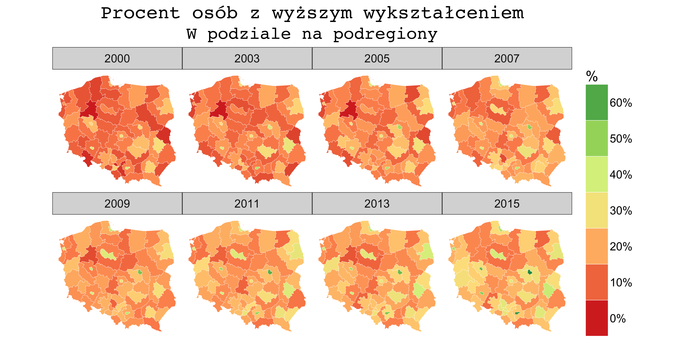

```{r setup, include=FALSE}
knitr::opts_chunk$set(echo = TRUE)
library(dplyr)
```

# Lub o tym jak spełnić swoje dziecięce marzenia

----

* <big>Co to jest mapa?</big>
* Skąd brać (nie)legalnie kontury granic?
* Jak rysować mapy w R

---

## Motywacja

```{r rysunekPodregiony, echo = FALSE, out.width = "800px"}

```

---

## Co chcemy potrafić zrobić?

* Pomalować wybrany obszar kolorem zależnym od pewnej zmiennej. Ewentualnie
dodać etykietkę
* Potrzebujemy wobec tego definicji każdego obszaru...
* ... a także połączenia obszaru ze zmienną nas interesującą (np. z GUSu)

---

## Czym jest mapa lub problemy z kulistością ziemi

* określonym matematycznie obrazem przestrzeni odzwierciedlającym 
rozmieszczenie obiektów i zjawisk geograficznych w zmniejszeniu (skala) i 
rzucie prostokątnym (odwzorowanie)
* zbiorem znaków kartograficznych i napisów, służących do prezentacji obiektów 
i zjawisk geograficznych
* odzwierciedla rzeczywistość w **specyficznie uogólniony sposób** – może być traktowana jako jej model.
* Na podstawie wykładu z Podstaw Kartografii dr. Waldemara Spalleka

---

## Technikalia

* Dane znajdują się specjalnych plikach. Najczęściej shp lub gjson. Można je wczytać
do R za pomocą pakietu **rgdal**
* Skąd wziąc dane? 
* CODGiK (województwa, powiaty, gminy)
* Portal Geostatystyczny (jednostki statystyczne)
* Eurostat (NUTS 1,2,3)
* Ludzie dobrej woli :)

---

```{r, message=FALSE, warning=FALSE}
require(rgdal) #funkcja readOGR
require(rgeos) #funkcja gSimplify i spTransform
library(ggplot2) #funkcja fortify
```


```{r, message = FALSE, warning = FALSE, cache = TRUE}
Wojewodztwa <- readOGR("data/wojewodztwa/", "wojewodztwa", 
											 encoding = "utf8")
#' zapisujemy informacje o województwach, które utracimy przy 
#' przeksztłcenia w data.frame
wojewodztwa_nazwy_kody <- data.frame(id = as.character(0:15), 
                                     teryt = Wojewodztwa$jpt_kod_je,  
                                     woj = Wojewodztwa$jpt_nazwa_, 
                                     stringsAsFactors = FALSE)
```

---

```{r, message = FALSE, warning = FALSE}
#' zmniejszamy dokładność, dzięki temu mapa będzie się 
#' szybciej rysować i zajmie mniej miejsca
wojewodztwa <- gSimplify(Wojewodztwa, tol = 1000, topologyPreserve = TRUE)
#' Jak mówiliśmy wcześniej jest wiele możliwych układów współrzędnych
wojewodztwa <- spTransform(wojewodztwa, CRS("+proj=longlat +datum=WGS84"))
Wojewodztwa <- fortify(wojewodztwa)

#' wyznaczamy centroidy województw (przydatne do etykietek)
centroidy_wojewodztw = data.frame(gCentroid(wojewodztwa, byid = TRUE))
centroidy_wojewodztw$id <- rownames((centroidy_wojewodztw))
```

---


## Najpierw przetwarzamy dane

```{r wczytanieDaneInternet, include=FALSE, eval = FALSE}
internet_dat <- read.csv(file = "data/internet_data.csv")

internet_podsumowanie <- internet_dat %>% 
  mutate(woj_id = as.character(woj_id)) %>% 
  filter(rok == 2015) %>%
  group_by(wojewodztwo, woj_id) %>%
  summarise(przecietnie_godzin_internetu = sum(waga*godzin_internetu)/sum(waga)) 

internet_podsumowanie_wiek <- internet_dat %>% 
  mutate(woj_id = as.character(woj_id)) %>% 
  filter(rok == 2015) %>%
  group_by(wojewodztwo, woj_id, wiek) %>%
  summarise(przecietnie_godzin_internetu = sum(waga*godzin_internetu)/sum(waga)) %>%
	filter(!is.na(wiek))

new_levels <- levels(internet_podsumowanie_wiek$wiek)
new_levels <- c(new_levels[6], new_levels[-6])
internet_podsumowanie_wiek$wiek <- factor(internet_podsumowanie_wiek$wiek,
																					levels = new_levels,
																					ordered = TRUE)

save(internet_podsumowanie, internet_podsumowanie_wiek, file = "data/uzywanie_internetu_diagnoza_spoleczna.Rdata")
```

```{r}
load("data/uzywanie_internetu_diagnoza_spoleczna.Rdata")
plotData <- inner_join(Wojewodztwa, internet_podsumowanie, 
											 by = c("id" = "woj_id"))
```

## Wizualizacja {.flexbox .vcenter}

```{r, fig.height = 4, fig.width = 8, warning = FALSE}
ggplot(data = plotData, mapping = aes(x = long, y = lat)) +
  geom_polygon(mapping = aes(group = group, fill = przecietnie_godzin_internetu))
```

----


---

## Rysowanie mapy

```{r, eval = FALSE}
ggplot(data = plotData, mapping = aes(x = long, y = lat)) +
		#rysujemy wielokąty
  geom_polygon(mapping = aes(group = group, 
							 fill = przecietnie_godzin_internetu)) +
    #ustawiamy układ współrzędnych
	coord_map() +
		#ustalamy paletę kolorów i skalę
  scale_fill_distiller("h", palette = "YlGn", 
								breaks = pretty_breaks(n = 6), 
								trans = "reverse") + 
		#ustawiamy obok siebie wykresy dla poszczególnych lat
  facet_wrap(~wiek, nrow = 2, ncol = 3) + 
  guides(fill = guide_legend(reverse = TRUE)) + 
	labs(title = "Liczba godzin spędzonych w internecie", 
			 subtitle = "tygodniowo, w podziale na województwa") + 
		#sugerowany styl wyglądu mapy
  theme_map(base_size = 18)
```

---

```{r, echo = FALSE, fig.align="top", fig.height = 6, fig.width = 8.5, warning = FALSE}
library(ggthemes)
library(scales)
plotData <- inner_join(Wojewodztwa, internet_podsumowanie_wiek, 
											 by = c("id" = "woj_id"))
ggplot(data = plotData, mapping = aes(x = long, y = lat)) +
		#rysujemy wielokąty
  geom_polygon(mapping = aes(group = group,   
  													 fill = przecietnie_godzin_internetu)) +
    #ustawiamy układ współrzędnych
	coord_map() +
		#ustalamy paletę kolorów i skalę
  scale_fill_distiller(name = "", palette = "RdYlGn", 
  										 breaks = pretty_breaks(n = 6), 
                       trans = "reverse") + 
		#ustawiamy obok siebie wykresy dla poszczególnych lat
  facet_wrap(facets = ~wiek, nrow = 2, ncol = 3) + 
  guides(fill = guide_legend(reverse = TRUE)) + 
		#sugerowany styl wyglądu mapy
  theme_map(base_size = 18)  +
	labs(title = "Liczba godzin spędzonych w internecie", 
			 subtitle = "tygodniowo, w podziale na województwa") + 
  theme(plot.title=element_text(size=24, hjust = 0.5, family = "mono"),
        plot.subtitle=element_text(size=22, hjust = 0.5, family = "mono"),
        legend.position="right",
        legend.key.height = unit(1.5, "cm"),
        legend.key.width = unit(1.2, "cm"))
```


# Tips and tricks

---

* Znalezienie projekcji mapy **proj4string(wczytane.shp)**
* Umieszczenie legendy w ,,wolnym miejscu" **theme(legened.position = c(0.1,0.1))**
* Dodanie etykietek w środku wielokątu **geom_label**
* Dodanie dodatkowego opisu na dole **labs(caption = "bla, bla, bla")**
